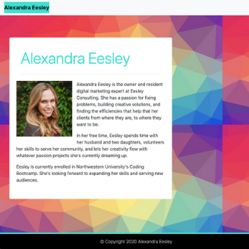

# responsive-portfolio-hw

## Table of Contents
* Description
* User Story
* Production Team
* Demo Link
* Screenshot
* Technology

## Description 
This is a student project from Northwestern University's Fall 2020 Full Time Coding Bootcamp Program. The project was to make a sample responsive student portfolio. The project features three pages (index.html, portfolio.html, and contact.html), a navbar, responsive layout, responsive images, and sample information about the student.

## User Story

* As a user, I would like to be able to display my portfolio to potential employers to showcase my work experience accomplishments.

## Production Team
* [Alex Eesley ](https://github.com/aeesley)

## Demo Links 
[Live Link](https://aeesley.github.io/responsive-portfolio-hw/)

[Github](https://github.com/aeesley/responsive-portfolio-hw)

## Screenshot

## Technology
HTML, CSS and Bootstrap's grid system and components were used for this project.
